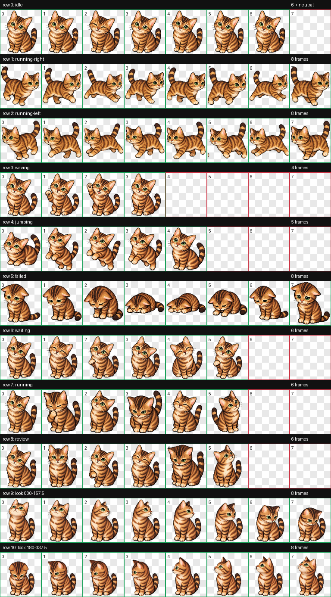

# Bengal Codex Pet

A pixel-art animated Bengal cat for the Codex/ChatGPT desktop pet feature. It includes nine activity animations and sixteen look directions.



## Install on Windows

1. Download this repository as a ZIP and extract it.
2. Copy the complete `bengal` folder into `%USERPROFILE%\.codex\pets\`.
3. Open the Codex desktop app.
4. Go to **Settings → Pets**, select **Refresh**, then choose **Bengal**.

The result should contain these files:

```text
%USERPROFILE%\.codex\pets\bengal\
├── pet.json
└── spritesheet.webp
```

## Install on macOS or Linux

Copy the complete `bengal` folder into `~/.codex/pets/`, then open **Settings → Pets**, select **Refresh**, and choose **Bengal**.

## Compatibility

This is a local desktop v2 pet package. The sprite sheet is 1536 × 2288 pixels and uses `spriteVersionNumber: 2`. It is intended for the Codex/ChatGPT desktop app rather than the ChatGPT web pet uploader.

## Files

- `bengal/pet.json` — pet metadata.
- `bengal/spritesheet.webp` — transparent 8 × 11 animated sprite atlas.
- `preview.png` — animation contact sheet.
